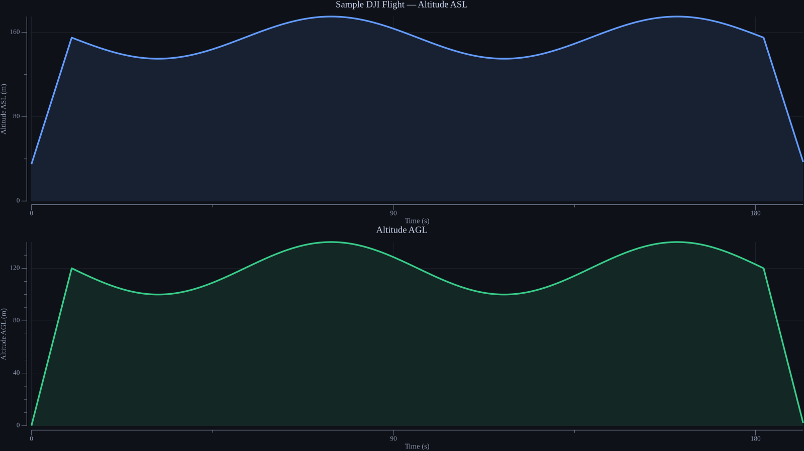
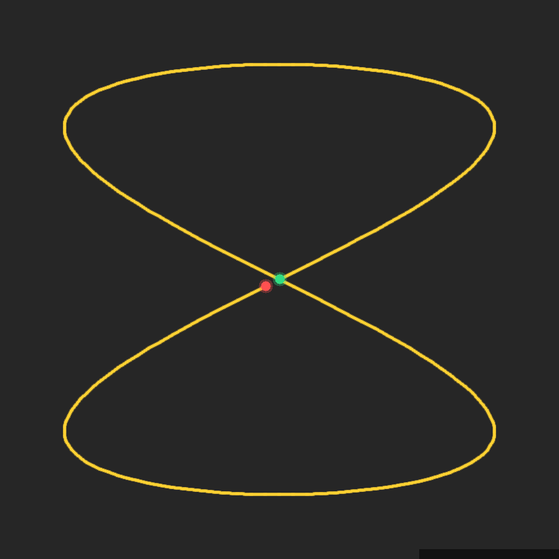

# downwash

**DJI drone post-flight analysis toolkit written in Go.**

`downwash` processes DJI MP4 video files and produces a complete post-flight package — GPX tracks, altitude charts, flight-path maps, Markdown reports, and aviation-themed PDF briefings — from the embedded telemetry captured by your drone.

> *Downwash* is the aviation term for the air pushed downward by a rotor — your drone's data, pushed straight to you.

> **Tested with:** DJI Mini 4 Pro

---

## Features

- **Telemetry extraction** — reads the DJI djmd protobuf stream via [exiftool](https://exiftool.org), parsing GPS, altitude, attitude, and camera settings at ~30 Hz
- **GPX 1.1 track file** — compatible with Google Earth, Garmin Basecamp, and any GPX-capable mapping tool
- **Altitude profile chart** — dual-panel PNG: altitude ASL and AGL over time, dark aviation theme
- **Flight track map** — top-down GPS path over dark OSM map tiles ([CartoDB dark_matter](https://carto.com/)), with automatic fallback to plain dark chart if tiles are unavailable
- **Markdown report** — structured summary of flight statistics, GPS, camera settings
- **PDF post-flight briefing** — three-page A4 landscape PDF with cover stats, altitude profile, and detailed telemetry table
- **Video transcode** — optional re-encode to H.264 (AVC) or H.265 (HEVC) at a target bitrate via ffmpeg
- **Interactive TUI** — terminal interface with file picker, options menu (toggle outputs, configure transcoding), real-time pipeline progress, and styled output (powered by [Bubble Tea](https://github.com/charmbracelet/bubbletea))
- **Configurable outputs** — choose which artefacts to produce: GPX, charts, markdown, PDF — all toggleable from the TUI options menu or via skip flags
- **Batch processing** — process an entire SD-card directory in one command; select a folder directly in the TUI file picker with `s`
- **Scriptable** — `--no-tui` flag disables the interactive interface for CI/CD pipelines and shell scripting
- **Cross-platform** — static binaries for macOS (arm64/amd64), Linux (amd64), Windows (amd64/arm64)

---

## Prerequisites

| Tool | Purpose | Install |
|---|---|---|
| [exiftool](https://exiftool.org) | Telemetry extraction | `brew install exiftool` / `apt install libimage-exiftool-perl` |
| [ffmpeg](https://ffmpeg.org) | Video probing & transcode | `brew install ffmpeg` / `apt install ffmpeg` |

Both tools must be available on `$PATH`. If they are missing, downwash will log a warning and skip the affected step rather than aborting.

---

## Installation

### Download a pre-built binary

Grab the latest release for your platform from the [Releases page](https://github.com/askrejans/downwash/releases):

```bash
# macOS (Apple Silicon)
curl -L https://github.com/askrejans/downwash/releases/latest/download/downwash_darwin_arm64.tar.gz | tar xz
sudo mv downwash /usr/local/bin/

# Linux (amd64)
curl -L https://github.com/askrejans/downwash/releases/latest/download/downwash_linux_amd64.tar.gz | tar xz
sudo mv downwash /usr/local/bin/

# Windows (PowerShell, amd64)
Invoke-WebRequest https://github.com/askrejans/downwash/releases/latest/download/downwash_windows_amd64.zip -OutFile downwash.zip
Expand-Archive downwash.zip
```

### Linux packages

```bash
# Debian / Ubuntu (.deb)
wget https://github.com/askrejans/downwash/releases/latest/download/downwash_amd64.deb
sudo dpkg -i downwash_amd64.deb

# Fedora / RHEL / CentOS (.rpm)
wget https://github.com/askrejans/downwash/releases/latest/download/downwash_amd64.rpm
sudo rpm -i downwash_amd64.rpm
```

### Build from source

```bash
git clone https://github.com/askrejans/downwash.git
cd downwash
go build -o downwash ./cmd/downwash
# or
make build
```

Requires **Go 1.21+**.

---

## Quick start

downwash auto-detects what you give it — a file, a directory, or nothing — and
picks the right mode:

```bash
# Interactive TUI — opens a file picker starting from your home directory
downwash

# Process a single video (plain CLI, no TUI)
downwash DJI_0001.MP4

# Process all MP4s in a directory → outputs to <dir>/processed/
downwash /Volumes/DJI/DCIM/100MEDIA

# Process with transcoding
downwash --transcode --codec h265 --bitrate 20M DJI_0001.MP4

# Custom output directory
downwash --output ~/flights/2025-06 DJI_0001.MP4

# Explicit subcommands still work too
downwash process DJI_0001.MP4
downwash batch --recursive /Volumes/DJI
```

---

## Usage modes

| Command | Mode | Description |
|---|---|---|
| `downwash` | TUI | Interactive file picker (starts at home directory) |
| `downwash <file.MP4>` | Plain CLI | Process a single video file |
| `downwash <directory>` | Plain CLI | Batch-process all MP4s, output to `<dir>/processed/` |
| `downwash process` | TUI | File picker via the `process` subcommand |
| `downwash process <file>` | TUI | Process with real-time progress view |
| `downwash batch <dir>` | Plain CLI | Batch with `--recursive` support |
| `downwash --no-tui` | Plain CLI | Force plain output (for scripts/CI) |

---

## Flags

| Flag | Default | Description |
|---|---|---|
| `-o`, `--output` | input file dir / `<dir>/processed/` | Directory for output artefacts |
| `--transcode` | false | Re-encode video with ffmpeg |
| `--codec` | `h264` | Transcode codec: `h264` or `h265` |
| `--bitrate` | `15M` | Target video bitrate (e.g. `15M`, `8M`) |
| `--preset` | `medium` | ffmpeg encode preset (`ultrafast` … `veryslow`) |
| `--skip-telemetry` | false | Skip exiftool extraction (no GPX/charts/reports) |
| `--skip-gpx` | false | Skip GPX track generation |
| `--skip-charts` | false | Skip altitude and track map charts |
| `--skip-markdown` | false | Skip Markdown report generation |
| `--skip-pdf` | false | Skip PDF briefing generation |
| `--no-tui` | false | Disable interactive TUI (plain text output) |
| `-v`, `--verbose` | false | Debug logging (shows ffmpeg/exiftool output) |
| `-r`, `--recursive` | false | Descend into sub-directories (batch mode) |

**Output files** (names derived from input basename):

| Artefact | Suffix | Description |
|---|---|---|
| GPX track | `_track.gpx` | GPS Exchange Format 1.1 |
| Altitude chart | `_altitude.png` | ASL + AGL panels, dark theme |
| Track map | `_track.png` | Top-down flight path PNG |
| Markdown report | `_report.md` | Human-readable flight summary |
| PDF briefing | `_briefing.pdf` | 3-page aviation-themed PDF |
| Transcoded video | `_h264.mp4` / `_h265.mp4` | Only with `--transcode` |

### `downwash version`

Print version information.

---

## Building for all platforms

```bash
# Current platform only
make build

# All supported platforms (output in dist/)
make cross-build
```

This produces static binaries (CGO_ENABLED=0):

| Platform | Output binary |
|---|---|
| macOS Apple Silicon | `dist/downwash_darwin_arm64` |
| macOS Intel | `dist/downwash_darwin_amd64` |
| Linux x86_64 | `dist/downwash_linux_amd64` |
| Windows x86_64 | `dist/downwash_windows_amd64.exe` |
| Windows ARM64 | `dist/downwash_windows_arm64.exe` |

### .deb and .rpm packages

Requires [nfpm](https://nfpm.goreleaser.com):

```bash
go install github.com/goreleaser/nfpm/v2/cmd/nfpm@latest

make package-deb   # produces dist/*.deb
make package-rpm   # produces dist/*.rpm
```

### Full release (goreleaser)

Requires [goreleaser](https://goreleaser.com):

```bash
go install github.com/goreleaser/goreleaser@latest

make release-snapshot   # dry run, no git tag required
make release            # publish (requires GITHUB_TOKEN + git tag)
```

---

## Development

```bash
# Run tests
make test

# Run tests with verbose output
make test-verbose

# Run integration tests (requires exiftool + ffmpeg)
# Set DJI_TEST_VIDEO to a real MP4 to exercise the full pipeline
DJI_TEST_VIDEO=path/to/flight.MP4 make test-integration

# Lint
make lint

# Regenerate sample artefacts in samples/
make sample
```

---

## Sample output

Pre-generated samples using synthetic flight data (no real location) are in [`samples/`](samples/).

### Altitude profile



### Flight track map



### All artefacts

| Artefact | File |
|:---|:---|
| Altitude chart | [`sample_flight_altitude.png`](samples/sample_flight_altitude.png) |
| Flight track map | [`sample_flight_track.png`](samples/sample_flight_track.png) |
| GPX track | [`sample_flight_track.gpx`](samples/sample_flight_track.gpx) |
| Markdown report | [`sample_flight_report.md`](samples/sample_flight_report.md) |
| PDF briefing | [`sample_flight_briefing.pdf`](samples/sample_flight_briefing.pdf) |

---

## Project structure

```
downwash/
├── cmd/downwash/        # CLI entry point (cobra)
├── internal/
│   ├── telemetry/       # exiftool extraction, frame parsing, FlightStats
│   ├── ffmpeg/          # ffmpeg/ffprobe wrappers
│   ├── geo/             # shared geodesy helpers (haversine, rounding)
│   ├── gpx/             # GPX 1.1 writer
│   ├── chart/           # gonum/plot chart renderers
│   ├── report/          # Markdown and PDF report generators
│   ├── pipeline/        # Orchestrates the full processing workflow
│   └── tui/             # Bubble Tea interactive terminal interface
├── samples/             # Pre-generated sample artefacts + generator
├── .goreleaser.yml      # Cross-platform release configuration
├── Makefile
└── go.mod
```

---

## Licence

GPL-3.0 — see [LICENSE](LICENSE).

## AI / ML opt-out

This repository and its contents are **not** licensed for use in AI/ML training datasets.
See `robots.txt` and `.ai-labeling` for machine-readable opt-out metadata.
